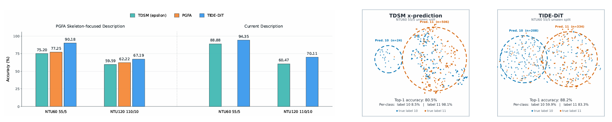
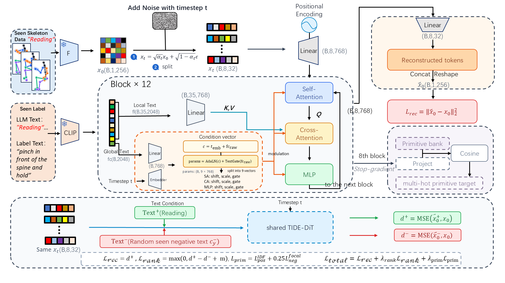

# TIDE-DiT

<p align="center">
  <a href="#data-preparation">📦 Data</a> &nbsp;|&nbsp;
  <a href="#training">🚀 Training</a> &nbsp;|&nbsp;
  <a href="#checkpoints">🔐 Checkpoints</a>
</p>

TIDE-DiT is a diffusion-based framework for zero-shot skeleton-based action recognition. It learns fine-grained skeleton-text alignment with token-level action descriptions, a primitive-aware training objective, and an optional frozen feature-graph refinement at inference time.

This implementation is built on [TDSM](https://github.com/KAIST-VICLab/TDSM). 

## 💡 Motivation

<p align="center">
  
</p>

The left comparison shows that expanding the action descriptions alone does not account for the performance gain: TIDE-DiT remains stronger under both the skeleton-focused and current descriptions. The right comparison exposes a failure mode of x-prediction TDSM on two semantically close unseen actions, where predictions collapse toward label 11. TIDE-DiT yields more balanced prediction regions and preserves the discriminative boundary between the two classes.

## 🧩 Training Framework

<p align="center">
  
</p>

Given frozen skeleton features and tokenized action descriptions, TIDE-DiT denoises a set of skeleton tokens with self-attention, text cross-attention, and global text modulation. The model reconstructs the feature representation while the primitive-aware branch supervises the intermediate token representation. Ranking against a randomly sampled seen-class description enforces a larger text-conditioned reconstruction margin.

## ✨ Highlights

- Fine-grained skeleton-token and text-token interaction in the diffusion transformer.
- Primitive-aware training that improves discrimination among semantically similar unseen actions.
- Label-free frozen feature-graph refinement, applied only after model training.
- Reproducible configurations for Shift-GCN, ST-GCN, and PKU-MMD protocols.

## 🛠️ Environment

The released settings were verified with the `tide` environment on Python 3.11.15, PyTorch 2.11.0, and CUDA 12.8.

```bash
conda create -n tide python=3.11 -y
conda activate tide
python -m pip install --upgrade pip
python -m pip install -r requirements.txt
```

Alternatively, create the same environment directly with `conda env create -f environment-tide-cu128.yml`.

`requirements.txt` installs CUDA 12.8 PyTorch wheels. For a different CUDA version, install the matching PyTorch, torchvision, and torchaudio wheels first, then install the remaining packages in `requirements.txt`.

The configurations use `sd2-community/stable-diffusion-2-1` with `local_files_only: true`. Download the model into the Hugging Face cache before running, or change that setting when online access is available.

## 📦 Data Preparation

We follow the evaluation settings of [SynSE](https://github.com/skelemoa/synse-zsl), [PURLS](https://github.com/azzh1/PURLS), and [SMIE](https://github.com/YujieOuO/SMIE). Download the **pre-extracted skeleton features** for the SynSE and SMIE settings, together with the class descriptions, from [SA-DVAE](https://github.com/pha123661/SA-DVAE).

**Note:** Pre-extracted skeleton features for the PURLS settings are not provided. Therefore, we extracted the skeleton features ourselves using the official [Shift-GCN](https://github.com/kchengiva/Shift-GCN) code.

Place pre-extracted skeleton features, class descriptions, label splits, and tokenized text features under `data/`:

```text
data/
  sk_feats/
    shift_ntu60_5_r/
    shift_ntu60_12_r/
    shift_ntu60_20_r/
    shift_ntu60_30_r/
    shift_ntu120_10_r/
    shift_ntu120_24_r/
    shift_ntu120_40_r/
    shift_ntu120_60_r/
    stgcn_ntu60_split{2,3,4}_5_r/
    stgcn_ntu120_split{2,3,4}_10_r/
    stgcn_pku51_split{1,2,3}_5_r/
  label_splits/
  class_lists/
  text_feats/
```

Each feature directory must contain `train.npy`, `train_label.npy`, `ztest.npy`, and `z_label.npy`. The corresponding label split and text-feature paths are specified in each YAML file.

## 🚀 Training

Each pair below first trains TIDE-DiT and then loads the selected checkpoint for feature-graph inference. The second command does not train the model again.

### Shift-GCN

#### NTU60 55/5

```bash
python scripts/train_feat_c2u_zsl.py --config ./config/tide_shiftgcn_ntu60_unseen5.yaml --seed 2026 --early-stop-patience 10
python scripts/train_feat_c2u_zsl.py --config ./config/tide_shiftgcn_ntu60_unseen5.yaml --seed 2026 --eval-only --resume-from-checkpoint ./result/shiftgcn/ntu60/unseen5/best --enable-feature-graph --eval-tag feature_graph --work-dir ./result/shiftgcn/ntu60/unseen5_feature_graph
```

#### NTU60 48/12

```bash
python scripts/train_feat_c2u_zsl.py --config ./config/tide_shiftgcn_ntu60_unseen12.yaml --seed 2026 --early-stop-patience 10
python scripts/train_feat_c2u_zsl.py --config ./config/tide_shiftgcn_ntu60_unseen12.yaml --seed 2026 --eval-only --resume-from-checkpoint ./result/shiftgcn/ntu60/unseen12/best --enable-feature-graph --eval-tag feature_graph --work-dir ./result/shiftgcn/ntu60/unseen12_feature_graph
```

#### NTU60 40/20

```bash
python scripts/train_feat_c2u_zsl.py --config ./config/tide_shiftgcn_ntu60_unseen20.yaml --seed 2026 --early-stop-patience 10
python scripts/train_feat_c2u_zsl.py --config ./config/tide_shiftgcn_ntu60_unseen20.yaml --seed 2026 --eval-only --resume-from-checkpoint ./result/shiftgcn/ntu60/unseen20/best --enable-feature-graph --eval-tag feature_graph --work-dir ./result/shiftgcn/ntu60/unseen20_feature_graph
```

#### NTU60 30/30

```bash
python scripts/train_feat_c2u_zsl.py --config ./config/tide_shiftgcn_ntu60_unseen30.yaml --seed 2026 --early-stop-patience 10
python scripts/train_feat_c2u_zsl.py --config ./config/tide_shiftgcn_ntu60_unseen30.yaml --seed 2026 --eval-only --resume-from-checkpoint ./result/shiftgcn/ntu60/unseen30/best --enable-feature-graph --eval-tag feature_graph --work-dir ./result/shiftgcn/ntu60/unseen30_feature_graph
```

#### NTU120 110/10

```bash
python scripts/train_feat_c2u_zsl.py --config ./config/tide_shiftgcn_ntu120_unseen10.yaml --seed 2026 --early-stop-patience 10
python scripts/train_feat_c2u_zsl.py --config ./config/tide_shiftgcn_ntu120_unseen10.yaml --seed 2026 --eval-only --resume-from-checkpoint ./result/shiftgcn/ntu120/unseen10/best --enable-feature-graph --eval-tag feature_graph --work-dir ./result/shiftgcn/ntu120/unseen10_feature_graph
```

#### NTU120 96/24

```bash
python scripts/train_feat_c2u_zsl.py --config ./config/tide_shiftgcn_ntu120_unseen24.yaml --seed 2026 --early-stop-patience 10
python scripts/train_feat_c2u_zsl.py --config ./config/tide_shiftgcn_ntu120_unseen24.yaml --seed 2026 --eval-only --resume-from-checkpoint ./result/shiftgcn/ntu120/unseen24/best --enable-feature-graph --eval-tag feature_graph --work-dir ./result/shiftgcn/ntu120/unseen24_feature_graph
```

#### NTU120 80/40

```bash
python scripts/train_feat_c2u_zsl.py --config ./config/tide_shiftgcn_ntu120_unseen40.yaml --seed 2026 --early-stop-patience 10
python scripts/train_feat_c2u_zsl.py --config ./config/tide_shiftgcn_ntu120_unseen40.yaml --seed 2026 --eval-only --resume-from-checkpoint ./result/shiftgcn/ntu120/unseen40/best --enable-feature-graph --eval-tag feature_graph --work-dir ./result/shiftgcn/ntu120/unseen40_feature_graph
```

#### NTU120 60/60

```bash
python scripts/train_feat_c2u_zsl.py --config ./config/tide_shiftgcn_ntu120_unseen60.yaml --seed 2026 --early-stop-patience 10
python scripts/train_feat_c2u_zsl.py --config ./config/tide_shiftgcn_ntu120_unseen60.yaml --seed 2026 --eval-only --resume-from-checkpoint ./result/shiftgcn/ntu120/unseen60/best --enable-feature-graph --eval-tag feature_graph --work-dir ./result/shiftgcn/ntu120/unseen60_feature_graph
```

### ST-GCN

#### NTU60 55/5, splits 2-4

```bash
python scripts/train_feat_c2u_zsl.py --config ./config/tide_stgcn_ntu60_split2_unseen5.yaml --seed 2026 --early-stop-patience 10
python scripts/train_feat_c2u_zsl.py --config ./config/tide_stgcn_ntu60_split2_unseen5.yaml --seed 2026 --eval-only --resume-from-checkpoint ./result/stgcn/ntu60/split2_unseen5/best --enable-feature-graph --eval-tag feature_graph --work-dir ./result/stgcn/ntu60/split2_unseen5_feature_graph

python scripts/train_feat_c2u_zsl.py --config ./config/tide_stgcn_ntu60_split3_unseen5.yaml --seed 2026 --early-stop-patience 10
python scripts/train_feat_c2u_zsl.py --config ./config/tide_stgcn_ntu60_split3_unseen5.yaml --seed 2026 --eval-only --resume-from-checkpoint ./result/stgcn/ntu60/split3_unseen5/best --enable-feature-graph --eval-tag feature_graph --work-dir ./result/stgcn/ntu60/split3_unseen5_feature_graph

python scripts/train_feat_c2u_zsl.py --config ./config/tide_stgcn_ntu60_split4_unseen5.yaml --seed 2026 --early-stop-patience 10
python scripts/train_feat_c2u_zsl.py --config ./config/tide_stgcn_ntu60_split4_unseen5.yaml --seed 2026 --eval-only --resume-from-checkpoint ./result/stgcn/ntu60/split4_unseen5/best --enable-feature-graph --eval-tag feature_graph --work-dir ./result/stgcn/ntu60/split4_unseen5_feature_graph
```

#### NTU120 110/10, splits 2-4

```bash
python scripts/train_feat_c2u_zsl.py --config ./config/tide_stgcn_ntu120_split2_unseen10.yaml --seed 2026 --early-stop-patience 10
python scripts/train_feat_c2u_zsl.py --config ./config/tide_stgcn_ntu120_split2_unseen10.yaml --seed 2026 --eval-only --resume-from-checkpoint ./result/stgcn/ntu120/split2_unseen10/best --enable-feature-graph --eval-tag feature_graph --work-dir ./result/stgcn/ntu120/split2_unseen10_feature_graph

python scripts/train_feat_c2u_zsl.py --config ./config/tide_stgcn_ntu120_split3_unseen10.yaml --seed 2026 --early-stop-patience 10
python scripts/train_feat_c2u_zsl.py --config ./config/tide_stgcn_ntu120_split3_unseen10.yaml --seed 2026 --eval-only --resume-from-checkpoint ./result/stgcn/ntu120/split3_unseen10/best --enable-feature-graph --eval-tag feature_graph --work-dir ./result/stgcn/ntu120/split3_unseen10_feature_graph

python scripts/train_feat_c2u_zsl.py --config ./config/tide_stgcn_ntu120_split4_unseen10.yaml --seed 2026 --early-stop-patience 10
python scripts/train_feat_c2u_zsl.py --config ./config/tide_stgcn_ntu120_split4_unseen10.yaml --seed 2026 --eval-only --resume-from-checkpoint ./result/stgcn/ntu120/split4_unseen10/best --enable-feature-graph --eval-tag feature_graph --work-dir ./result/stgcn/ntu120/split4_unseen10_feature_graph
```

#### PKU-MMD 46/5, splits 1-3

```bash
python scripts/train_feat_c2u_zsl.py --config ./config/tide_stgcn_pku51_split1_unseen5.yaml --seed 2026 --early-stop-patience 10
python scripts/train_feat_c2u_zsl.py --config ./config/tide_stgcn_pku51_split1_unseen5.yaml --seed 2026 --eval-only --resume-from-checkpoint ./result/stgcn/pku51/split1_unseen5/best --enable-feature-graph --eval-tag feature_graph --work-dir ./result/stgcn/pku51/split1_unseen5_feature_graph

python scripts/train_feat_c2u_zsl.py --config ./config/tide_stgcn_pku51_split2_unseen5.yaml --seed 2026 --early-stop-patience 10
python scripts/train_feat_c2u_zsl.py --config ./config/tide_stgcn_pku51_split2_unseen5.yaml --seed 2026 --eval-only --resume-from-checkpoint ./result/stgcn/pku51/split2_unseen5/best --enable-feature-graph --eval-tag feature_graph --work-dir ./result/stgcn/pku51/split2_unseen5_feature_graph

python scripts/train_feat_c2u_zsl.py --config ./config/tide_stgcn_pku51_split3_unseen5.yaml --seed 2026 --early-stop-patience 10
python scripts/train_feat_c2u_zsl.py --config ./config/tide_stgcn_pku51_split3_unseen5.yaml --seed 2026 --eval-only --resume-from-checkpoint ./result/stgcn/pku51/split3_unseen5/best --enable-feature-graph --eval-tag feature_graph --work-dir ./result/stgcn/pku51/split3_unseen5_feature_graph
```

The same commands and a configuration/output-directory index are available in [config/TIDE_FINAL_CONFIGS.md](config/TIDE_FINAL_CONFIGS.md).

## 🔐 Checkpoints

Pretrained TIDE-DiT checkpoints will be released upon paper acceptance.

## 📊 Outputs

Training and final inference results are organized by backbone and dataset:

```text
result/
  shiftgcn/ntu60/unseen5/
  shiftgcn/ntu60/unseen5_feature_graph/
  shiftgcn/ntu120/
  stgcn/ntu60/
  stgcn/ntu120/
  stgcn/pku51/
```

Each run stores the resolved configuration, checkpoint, validation log, metrics, predictions, confusion matrix, and per-class accuracy.
